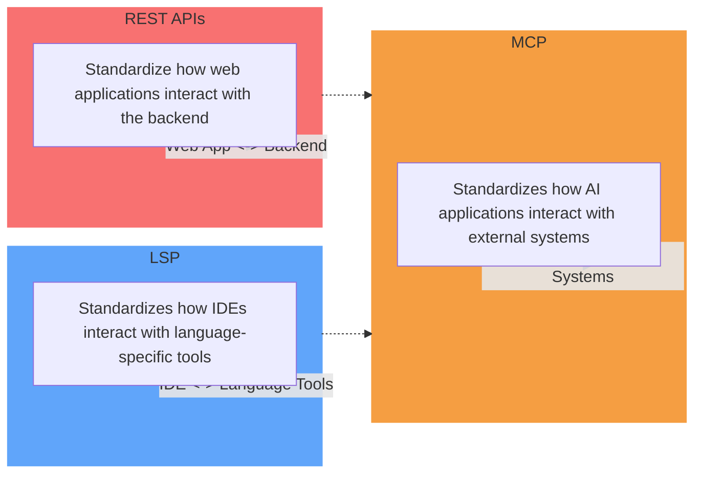

# Model Context Protocol (MCP) in Action

Welcome to the interactive guide and demo repo for the "Model Context Protocol (MCP) in Action" talk!

## Table of Contents

0. [Speaker Introduction](#speaker-introduction)
    - About the Speaker
    - Experience & Background
    - Contact Information

1. [Introduction](#introduction)
    - [Why MCP? (Context is King)](#why-mcp-context-is-king)
    - What is the Model Context Protocol (MCP)?
    - What will you learn and see demoed today?
2. [MCP Core Concepts](#mcp-core-concepts)
    - Tools
    - Resources
    - Prompts
3. [MCP Architecture](#mcp-architecture)
    - Client-Server Model
    - Communication Lifecycle
4. [Transports](#transports)
    - Local (stdio)
    - Remote (HTTP+SSE, Streamable HTTP)
5. [Ecosystem & Adoption](#ecosystem--adoption)
    - Community & Open Source
    - Enterprise Use Cases
6. [Real-World Examples](#real-world-examples)
    - Calculator MCP Server (Demo)
    - Brand Kit MCP Server (Demo)
    - Conversational Intelligence MCP (Demo)
7. [Prompt Engineering](#prompt-engineering)
    - Good vs. Bad Prompts
    - Prompt Templates
8. [Security & Auth](#security--auth)
    - Authentication & Authorization
    - Best Practices
9. [Live Demos](#live-demos)
    - Running MCP Inspector
    - Connecting Clients (Claude, n8n, OpenAI, etc.)
    - End-to-End Example Flows
10. [Deployment Options](#deployment-options)
    - n8n
    - Cloudflare
    - Local
    - Replit/Cloud
    - GCP
11. [Q&A](#qa)

---

Each section links to a detailed explanation, code samples, and live demo instructions. Use the navigation above to jump to any topic!

---

## Speaker Introduction

### About the Speaker

**Mike Onslow**  
- CTO @ [Clarity Voice](https://clarityvoice.com)
- Co-Host @ [Artificial Antics Podcast](https://antics.tv)

### Contact Information

- LinkedIn: [mikeonslow](https://www.linkedin.com/in/mikeonslow/)
- Email: [mike@antics.tv](mailto:mike@antics.tv)
- Twitter: [@mikeonslow](https://twitter.com/mikeonslow)

> **Let's connect!** I'm always excited to discuss AI, voice technology, and automation. Feel free to reach out through any of the channels above.

---

## Why MCP? (Context is King)

Building AI tools today means connecting to databases, fetching documents, running calculations, and integrating with third-party apps. Each integration requires custom code—different APIs, data formats, and security models. Adding new tools or data sources means more glue code and edge cases, taking time away from core product development.

This creates a messy situation where every connection is custom-built and fragile. Everyone speaks a different language.

What if there was a standard? What if AI tools could all speak the same language—one built for context, security, and extensibility?

That's where MCP comes in. MCP is about **context**—delivering the right information, tools, and prompts to your AI, exactly when it needs them. It's about making your AI smarter, more capable, and easier to build, by giving it a common protocol for everything it needs to do.

> **Context is king.** The more relevant, timely, and structured the context you give your AI, the more powerful and reliable it becomes. MCP is the backbone that makes this possible.

## The Evolution of Protocols

Just as REST standardized web APIs and LSP standardized IDE tooling, MCP standardizes how AI applications interact with external systems. Let's look at how these protocols evolved:

---

> **Tip:** This repo is designed for both live presentation and as a reference for building your own MCP-powered AI tools.