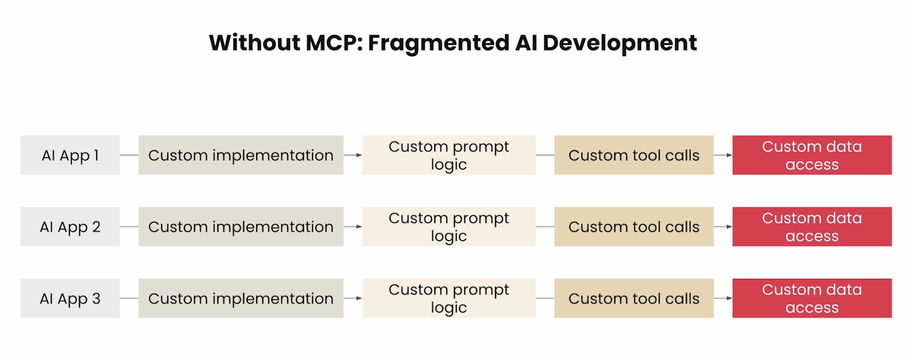
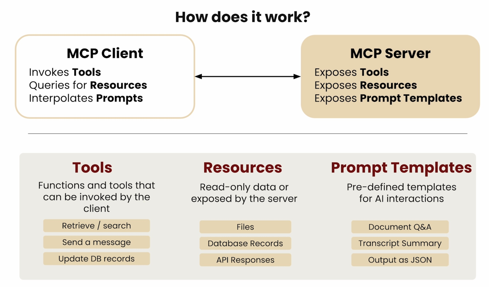
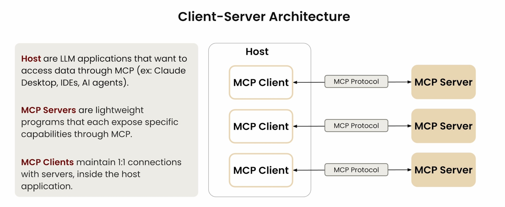
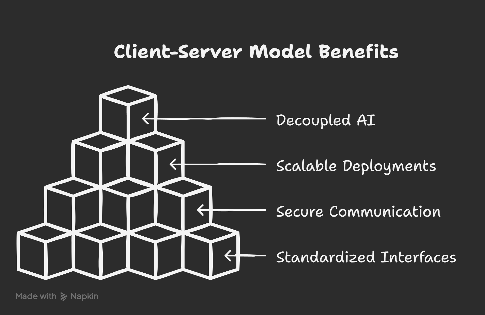

# Model Context Protocol (MCP) in Action

Welcome to the interactive guide and demo repo for the "Model Context Protocol (MCP) in Action" talk!

## Table of Contents

0. [Speaker Introduction](#speaker-introduction)

1. [Introduction](#introduction)
    - [Why MCP? (Context is King)](#why-mcp-context-is-king)
    - [What is the Model Context Protocol (MCP)?](#what-is-mcp)
    - [The Evolution of Protocols](#the-evolution-of-protocols)
    - [What will you learn and see demoed today?](#what-will-you-learn)
    - [Live Demos](#live-demos)
2. [MCP Core Concepts](#mcp-core-concepts)
    - [Tools](#tools)
    - [Resources](#resources)
    - [Prompts](#prompts)
3. [MCP Architecture](#mcp-architecture)
    - [Client-Server Model](#client-server-model)
    - [Communication Lifecycle](#communication-lifecycle)
4. [Transports](#transports)
    - [Local (stdio)](#local-transport)
    - [Remote (HTTP+SSE, Streamable HTTP)](#remote-transport)
5. [Ecosystem & Adoption](#ecosystem--adoption)
    - [Community & Open Source](#community)
    - [Enterprise Use Cases](#enterprise)
6. [Real-World Examples](#real-world-examples)
    - [Calculator MCP Server (Demo)](#calculator-demo)
    - [Brand Kit MCP Server (Demo)](#brand-kit-demo)
    - [Conversational Intelligence MCP (Demo)](#conversational-intelligence-demo)
7. [Prompt Engineering](#prompt-engineering)
    - [Good vs. Bad Prompts](#prompt-best-practices)
    - [Prompt Templates](#prompt-templates)
8. [Security & Auth](#security--auth)
    - [Authentication & Authorization](#auth)
    - [Best Practices](#security-best-practices)
9. [Live Demos](#live-demos)
    - [Connecting Clients](#client-integration)
    - [End-to-End Example Flows](#example-flows)
10. [MCP Inspector & Debugging](#mcp-inspector--debugging)
    - [Server Inspection & Testing](#server-inspection)
    - [Tools & Resources Exploration](#tools-exploration)
    - [Debugging Best Practices](#debugging)
11. [Deployment Options](#deployment-options)
    - [n8n](#n8n-deployment)
    - [Cloudflare](#cloudflare-deployment)
    - [Local](#local-deployment)
    - [Replit/Cloud](#replit-deployment)
    - [GCP](#gcp-deployment)
12. [Q&A](#qa)

---

Each section links to a detailed explanation, code samples, and live demo instructions. Use the navigation above to jump to any topic!

---

## Speaker Introduction

### About the Speaker

**Mike Onslow**  
- CTO @ [Clarity Voice](https://clarityvoice.com)
- Co-Host @ [Artificial Antics Podcast](https://antics.tv)

### Contact Information

- LinkedIn: [mikeonslow](https://www.linkedin.com/in/mikeonslow/)
- Email: [mike@antics.tv](mailto:mike@antics.tv)
- Twitter: [@mikeonslow](https://twitter.com/mikeonslow)

> **Let's connect!** I'm always excited to discuss AI, voice technology, and automation. Feel free to reach out through any of the channels above.

---

## Why MCP? (Context is King)

Building AI tools today means connecting to databases, fetching documents, running calculations, and integrating with third-party apps. Each integration requires custom code—different APIs, data formats, and security models. Adding new tools or data sources means more glue code and edge cases, taking time away from core product development.

This creates a messy situation where every connection is custom-built and fragile. Everyone speaks a different language.

What if there was a standard? What if AI tools could all speak the same language—one built for context, security, and extensibility?

That's where MCP comes in. MCP is about **context**—delivering the right information, tools, and prompts to your AI, exactly when it needs them. It's about making your AI smarter, more capable, and easier to build, by giving it a common protocol for everything it needs to do.

### The Evolution of Protocols

Just as REST standardized web APIs and LSP standardized IDE tooling, MCP standardizes how AI applications interact with external systems. Let's look at how these protocols evolved

| Protocol | Purpose | Impact |
|----------|---------|---------|
| REST | Standardized web APIs | Enabled the modern web |
| LSP | Standardized IDE tooling | Revolutionized code editing |
| MCP | Standardizes AI context | Powers next-gen AI tools |

### What Will You Learn?

1. **Core Concepts**
   - What MCP is and why it matters
   - How MCP standardizes AI context
   - Key components and architecture

2. **Technical Walk-through**
   - Building MCP servers
   - Creating MCP clients
   - Implementing transports
   - Security and authentication

3. **Real-World Applications**
   - Live demos of MCP in action
   - Integration patterns
   - Best practices and gotchas

4. **Hands-On Experience**
   - Deploying your own MCP server
   - Building a simple MCP client
   - Testing and debugging

### Live Demos

You'll see MCP in action through several live demonstrations:

1. **Calculator MCP Demo**
   - Simple MCP server that adds two numbers
   - Client integration with n8n
   - Live calculation demonstration

2. **Conversational Intelligence Agent**
   - Analyze ~125 call details (transcript, summary, dialogs, parties)
   - Real-time insights and analysis
   - n8n + Replit integration

3. **Brand Kit MCP Server**
   - Brand color and font integration
   - Cursor AI content generation
   - Live web component creation

> **Get Ready!** By the end of this session, you'll have everything you need to start building your own MCP-powered AI applications.

## MCP Core Concepts

### Tools

Tools are the building blocks of MCP servers that enable AI models to interact with external systems and perform specific tasks. Each tool defines:

- A unique identifier
- Input parameters and their types
- Output format
- Description of its functionality

### Resources

Resources provide persistent data storage and state management for MCP servers. They can be:

- Files and documents
- Databases and key-value stores
- External API connections
- Configuration settings

Resources enable tools to maintain context and state across multiple interactions.

### Prompts

Prompts define the conversation flow and instructions for AI models. They include:

- System instructions
- User messages
- Tool usage patterns
- Response formatting

Well-crafted prompts are essential for reliable and consistent AI behavior.

## Client-Server Model

The MCP follows a client-server architecture where:

1. **MCP Client**
   - Initiates requests to MCP servers
   - Handles authentication and transport
   - Manages conversation state
   - Processes server responses

2. **MCP Server**
   - Exposes tools and resources
   - Processes client requests
   - Manages AI model interactions
   - Returns structured responses

3. **MCP Host**
   - Provides runtime environment for MCP servers
   - Manages server lifecycle and scaling
   - Handles resource allocation
   - Ensures high availability and reliability
   - Supports multiple deployment options (local, cloud, edge)

---

The client-server model enables:
- Decoupled AI capabilities
- Scalable deployments
- Secure communication
- Standardized interfaces

## Communication Lifecycle

[Content coming soon]

## Local Transport

[Content coming soon]

## Remote Transport

[Content coming soon]

## Community

[Content coming soon]

## Enterprise

[Content coming soon]

## Calculator Demo

[Content coming soon]

## Brand Kit Demo

[Content coming soon]

## Conversational Intelligence Demo

[Content coming soon]

## Prompt Best Practices

[Content coming soon]

## Prompt Templates

[Content coming soon]

## Auth

[Content coming soon]

## Security Best Practices

[Content coming soon]

## Client Integration

[Content coming soon]

## Example Flows

[Content coming soon]

## Server Inspection

[Content coming soon]

## Tools Exploration

[Content coming soon]

## Debugging

[Content coming soon]

## n8n Deployment

[Content coming soon]

## Cloudflare Deployment

[Content coming soon]

## Local Deployment

[Content coming soon]

## Replit Deployment

[Content coming soon]

## GCP Deployment

[Content coming soon]
