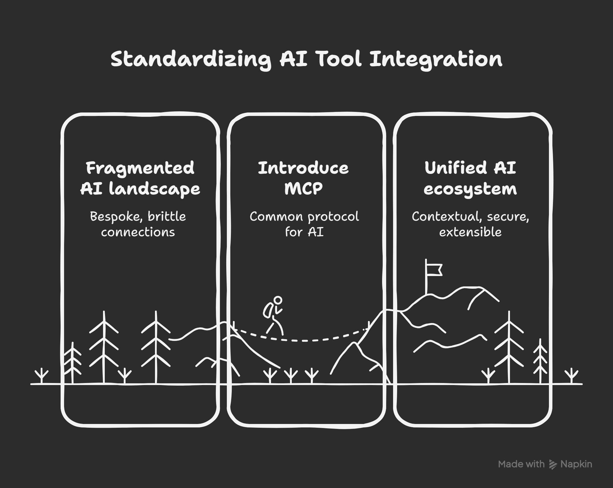

# Model Context Protocol (MCP) in Action

Welcome to the interactive guide and demo repo for the "Model Context Protocol (MCP) in Action" talk!

## Table of Contents

0. [Speaker Introduction](#speaker-introduction)

1. [Introduction](#introduction)
    - [Why MCP? (Context is King)](#why-mcp-context-is-king)
    - [What is the Model Context Protocol (MCP)?](#what-is-mcp)
    - [The Evolution of Protocols](#the-evolution-of-protocols)
    - [What will you learn and see demoed today?](#what-will-you-learn)
    - [Live Demos](#live-demos)
2. [MCP Core Concepts](#mcp-core-concepts)
    - [Tools](#tools)
    - [Resources](#resources)
    - [Prompts](#prompts)
3. [MCP Architecture](#mcp-architecture)
    - [Client-Server Model](#client-server-model)
    - [Communication Lifecycle](#communication-lifecycle)
    - [Transports](#transports)
        - [Local (stdio)](#local-transport)
        - [Remote (HTTP+SSE, Streamable HTTP)](#remote-transport)
4. [Ecosystem & Adoption](#ecosystem--adoption)
    - [Community & Open Source](#community)
    - [Enterprise Use Cases](#enterprise)
5. [Real-World Examples](#real-world-examples)
    - [Calculator MCP Server (Demo)](#calculator-demo)
    - [Conversational Intelligence MCP (Demo)](#conversational-intelligence-demo)
6. [Prompt Engineering](#prompt-engineering)
    - [Good vs. Bad Prompts](#prompt-best-practices)
    - [Prompt Templates](#prompt-templates)
7. [Security & Auth](#security--auth)
    - [Authentication & Authorization](#auth)
    - [Best Practices](#security-best-practices)
8. [Live Demos](#live-demos)
    - [Connecting Clients](#client-integration)
    - [End-to-End Example Flows](#example-flows)
9. [MCP Inspector & Debugging](#mcp-inspector--debugging)
    - [Server Inspection & Testing](#server-inspection)
    - [Tools & Resources Exploration](#tools-exploration)
    - [Debugging Best Practices](#debugging)
10. [Deployment Options](#deployment-options)
    - [n8n](#n8n-deployment)
    - [Cloudflare](#cloudflare-deployment)
    - [Local](#local-deployment)
    - [Replit/Cloud](#replit-deployment)
    - [GCP](#gcp-deployment)
11. [Q&A](#qa)

---

Each section links to a detailed explanation, code samples, and live demo instructions. Use the navigation above to jump to any topic!

---

## Speaker Introduction

### About the Speaker


**Mike Onslow**  
- CTO @ [Clarity Voice](https://clarityvoice.com)
- Co-Host @ [Artificial Antics Podcast](https://antics.tv)

### Contact Information

- LinkedIn: [mikeonslow](https://www.linkedin.com/in/mikeonslow/)
- Email: [mike@antics.tv](mailto:mike@antics.tv)
- Twitter: [@mikeonslow](https://twitter.com/mikeonslow)

> **Let's connect!** I'm always excited to discuss AI, voice technology, and automation. Feel free to reach out through any of the channels above.

---

## Why MCP? (Context is King)

Building AI tools today means connecting to databases, fetching documents, running calculations, and integrating with third-party apps. Each integration requires custom code—different APIs, data formats, and security models. Adding new tools or data sources means more glue code and edge cases, taking time away from core product development.


This creates a messy situation where every connection is custom-built and fragile. Everyone speaks a different language.

What if there was a standard? What if AI tools could all speak the same language—one built for context, security, and extensibility?

That's where MCP comes in. MCP is about **context**—delivering the right information, tools, and prompts to your AI, exactly when it needs them. It's about making your AI smarter, more capable, and easier to build, by giving it a common protocol for everything it needs to do.

<br />



### The Evolution of Protocols

Just as REST standardized web APIs and LSP standardized IDE tooling, MCP standardizes how AI applications interact with external systems. Let's look at how these protocols evolved

| Protocol | Purpose | Impact |
|----------|---------|---------|
| REST | Standardized web APIs | Enabled the modern web |
| LSP | Standardized IDE tooling | Revolutionized code editing |
| MCP | Standardizes AI context | Powers next-gen AI tools |

### What Will You Learn?

1. **Core Concepts**
   - What MCP is and why it matters
   - How MCP standardizes AI context
   - Key components and architecture

2. **Technical Walk-through**
   - Building MCP servers
   - Creating MCP clients
   - Implementing transports
   - Security and authentication

3. **Real-World Applications**
   - Live demos of MCP in action
   - Integration patterns
   - Best practices and gotchas

4. **Hands-On Experience**
   - Deploying your own MCP server
   - Building a simple MCP client
   - Testing and debugging

### Live Demos

You'll see MCP in action through several live demonstrations:

#### **Calculator MCP Demo**
   - Simple MCP server that adds two numbers
   - Client integration with n8n
   - Live calculation demonstration

#### **Conversational Intelligence Agent**
   - Analyze ~125 call details (transcript, summary, dialogs, parties)
   - Real-time insights and analysis
   - n8n + Replit integration

<br />

> **Get Ready!** By the end of this session, you'll have everything you need to start building your own MCP-powered AI applications.

## MCP Core Concepts


### Tools

Tools are the building blocks of MCP servers that enable AI models to interact with external systems and perform specific tasks. Each tool defines:

- A unique identifier
- Input parameters and their types
- Output format
- Description of its functionality

### Resources

Resources provide persistent data storage and state management for MCP servers. They can be:

- Files and documents
- Databases and key-value stores
- External API connections
- Configuration settings

Resources enable tools to maintain context and state across multiple interactions.

### Prompts

Prompts define the conversation flow and instructions for AI models. They include:

- System instructions
- User messages
- Tool usage patterns
- Response formatting

Well-crafted prompts are essential for reliable and consistent AI behavior.

# MCP Architecture

## Client-Server Model

The MCP follows a client-server architecture where:

1. **MCP Client**
   - Initiates requests to MCP servers
   - Handles authentication and transport
   - Manages conversation state
   - Processes server responses

2. **MCP Server**
   - Exposes tools and resources
   - Processes client requests
   - Manages AI model interactions
   - Returns structured responses

3. **MCP Host**
   - Provides runtime environment for MCP servers
   - Manages server lifecycle and scaling
   - Handles resource allocation
   - Ensures high availability and reliability
   - Supports multiple deployment options (local, cloud, edge)

<br />


The client-server model enables:
- Decoupled AI capabilities
- Scalable deployments
- Secure communication
- Standardized interfaces

<br />


## Communication Lifecycle

The MCP communication lifecycle follows these key steps:

1. **Connection Establishment**
   - Client initiates connection to MCP server
   - Authentication and handshake
   - Transport protocol negotiation

2. **Request Processing**
   - Client sends structured request
   - Server validates and processes request
   - Tools and resources are accessed
   - AI model generates response

3. **Response Handling**
   - Server formats response
   - Client processes and displays results
   - State is updated if needed

4. **Error Handling**
   - Graceful error recovery
   - Retry mechanisms
   - Fallback options

5. **Connection Management**
   - Keep-alive mechanisms
   - Connection pooling
   - Resource cleanup

This lifecycle ensures:
- Reliable communication
- State consistency
- Error resilience
- Resource efficiency


<br />


### Transports

The MCP supports multiple transport mechanisms for client-server communication:

#### Local Transport
- Direct in-process communication
- Zero network overhead
- Ideal for single-machine deployments
- Synchronous execution model

#### Remote Transport
- Network-based communication
- Supports distributed deployments
- Asynchronous execution model
- Built-in retry and error handling

## Ecosystem & Adoption

The MCP ecosystem is growing rapidly, with adoption across various sectors:

### Community Growth
- Active developer community
- Open source contributions
- Regular meetups and workshops
- Growing documentation and resources

### Enterprise Adoption
- Fortune 500 companies implementing MCP
- Integration with existing AI infrastructure
- Custom MCP server development
- Enterprise-grade security features

<br />


### Key Benefits
- Standardized AI tooling
- Reduced development time
- Improved security
- Better scalability
- Enhanced maintainability

### Future Roadmap
- Enhanced tooling support
- Additional transport protocols
- Improved debugging capabilities
- Enterprise features
- Cloud-native deployments

## Demos

## Calculator Demo

The Calculator MCP app demonstrates how an AI agent can use the Model Context Protocol (MCP) to perform calculations:

- **MCP Server:** Exposes a calculator tool via MCP.  
  [Calculator_MCP_Server.json](demos/calculator/Calculator_MCP_Server.json)

- **MCP Client Agent:** Receives user messages, uses AI to interpret them, and calls the server for results.  
  [Calculator_MCP_Client_Agent.json](demos/calculator/Calculator_MCP_Client_Agent.json)


The Calculator demo shows how MCP enables AI agents to use external tools:

1. **User Input:** The user sends a message like "What is 123 * 456?"

2. **Client Processing:**
   - The AI agent receives the message
   - Analyzes the request to identify the calculation needed
   - Determines which MCP tool to use

3. **MCP Communication:**
   - Client sends the calculation request to the MCP server
   - Server performs the calculation using its calculator tool (built into n8n)
   - Result is returned to the client

4. **Response:**
   - AI agent receives the calculation result
   - Formats and returns the answer to the user

This MCP enables AI agents to:
- Delegate specific tasks to specialized tools
- Maintain clean separation between AI reasoning and tool execution
- Scale capabilities by adding new tools without changing the agent


## Conversational Intelligence Demo

**Summary**

The Conversation Analyzer demo is a system that helps users search, analyze, and get insights from conversations, such as call transcripts. It uses an AI agent to understand user questions and select the right tools to find answers. The system is split into two main parts: the client (which handles user interaction and AI reasoning) and the server (which stores the data and provides search and analytics tools).

---

### Client

- Listens for user messages and questions.
- Uses AI to figure out what the user wants.
- Picks the best tool(s) to answer the question.
- Can use both OpenAI and Google Gemini for understanding and summarizing.
- Remembers recent conversation context for better responses.

**Key Features:**
- Understands natural language questions.
- Chooses and combines tools to answer complex queries.
- Summarizes and explains results clearly.

---

### Server

- Stores all conversation data, including transcripts, participants, and summaries.
- Provides a set of tools for searching, analyzing, and summarizing conversations.
- Logs every tool use for tracking and improvement.

**Key Features:**
- Search conversations by topic, keywords, or participant.
- Find specific details about any conversation.
- Search for parts of conversations with certain emotions (like anger or frustration).
- Show statistics about calls, such as how many were inbound or outbound, and average call length.
- List common topics discussed in conversations.
- Track how often each tool is used and how well they perform.
- Create and update special data (embeddings) to improve search results.

**In short:**  
The client helps users ask questions and get answers, while the server does the heavy lifting of searching and analyzing the conversation data. Together, they make it easy to find insights in large sets of conversations.

**Example Chat**

[example-conv-intelligence-chat.pdf](example-conv-intelligence-chat.pdf)


## Auth

Authentication in MCP is essential for securing communication between clients and servers. While MCP supports various authentication methods, we'll focus on the most common and straightforward approach: Bearer Token Authentication.

### Basic Authentication Flow

1. **Bearer Token Setup**
   - Generate a secure token for your MCP server
   - Configure the token in your client application
   - Include the token in request headers

2. **Implementation Example**
   ```json
   {
     "parameters": {
       "sseEndpoint": "https://your-mcp-server.com",
       "authentication": "bearerAuth"
     },
     "credentials": {
       "httpBearerAuth": {
         "token": "your-secure-token"
       }
     }
   }
   ```

### Security Considerations

- Keep tokens secure and never expose them in client-side code
- Use HTTPS for all MCP communications
- Rotate tokens regularly
- Implement proper token validation on the server side

### Best Practices

1. **Token Management**
   - Store tokens securely
   - Use environment variables for token values
   - Implement token expiration
   - Have a token rotation strategy

2. **Error Handling**
   - Handle authentication failures gracefully
   - Provide clear error messages
   - Implement proper logging for security events

> **Note:** While this covers basic authentication, enterprise applications may require more sophisticated authentication methods like OAuth 2.0 or custom authentication schemes. These can be implemented based on your specific security requirements.

## Server Inspection

The Model Context Protocol (MCP) Server Inspector is a diagnostic tool designed to analyze and visualize the internal workings of model contexts within a server environment. It inspects incoming requests, traces token usage, and reveals how context windows are allocated and consumed during interactions with language models. This tool helps developers understand truncation behaviors, monitor context overflows, and debug prompt construction issues in real-time, making it invaluable for optimizing LLM performance in production systems.

You start the spector by typing `npx @modelcontextprotocol/inspector`

More documentation on inspector here: https://modelcontextprotocol.io/docs/tools/inspector

## n8n Deployment

Very simple no code implementation for both MCP clients and servers

n8n documentation linked below

#### Client
https://docs.n8n.io/integrations/builtin/cluster-nodes/sub-nodes/n8n-nodes-langchain.toolmcp/

#### Server
https://docs.n8n.io/integrations/builtin/core-nodes/n8n-nodes-langchain.mcptrigger/

## Cloudflare Deployment

https://blog.cloudflare.com/remote-model-context-protocol-servers-mcp/

## Resources

### Course on building MCP apps:
https://learn.deeplearning.ai/courses/mcp-build-rich-context-ai-apps-with-anthropic

Contact Me:

## Questions? Contact Me

If you have any questions, feedback, or need assistance with this project, feel free to reach out:

- **Email**: mailto:mike@antics.tv
- **LinkedIn**: https://www.linkedin.com/in/mikeonslow/
- **Twitter**: https://x.com/mike_onslow

I'm always happy to help and collaborate on interesting projects!

